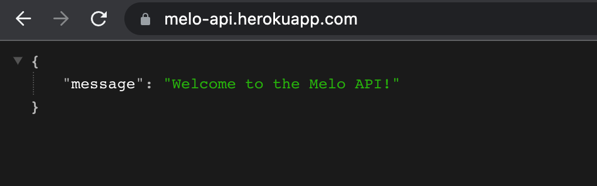
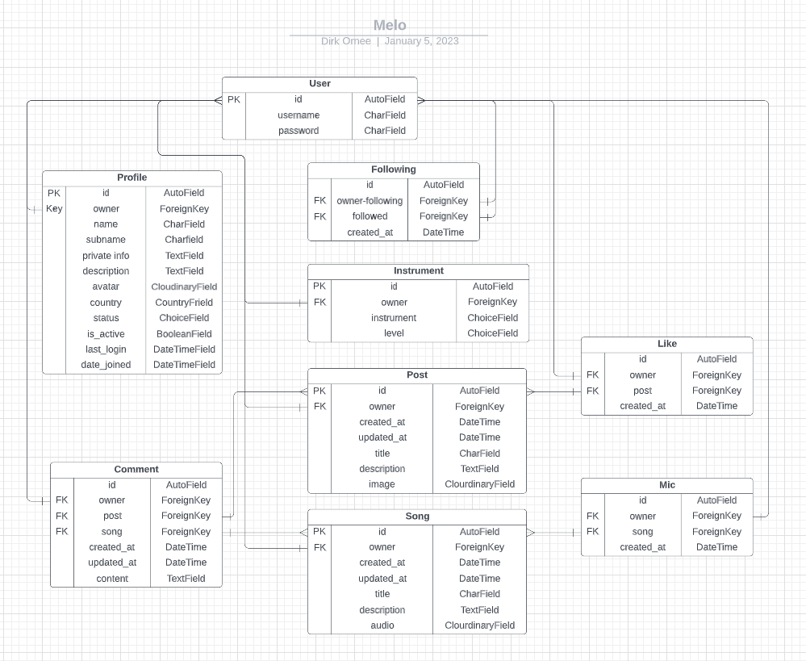
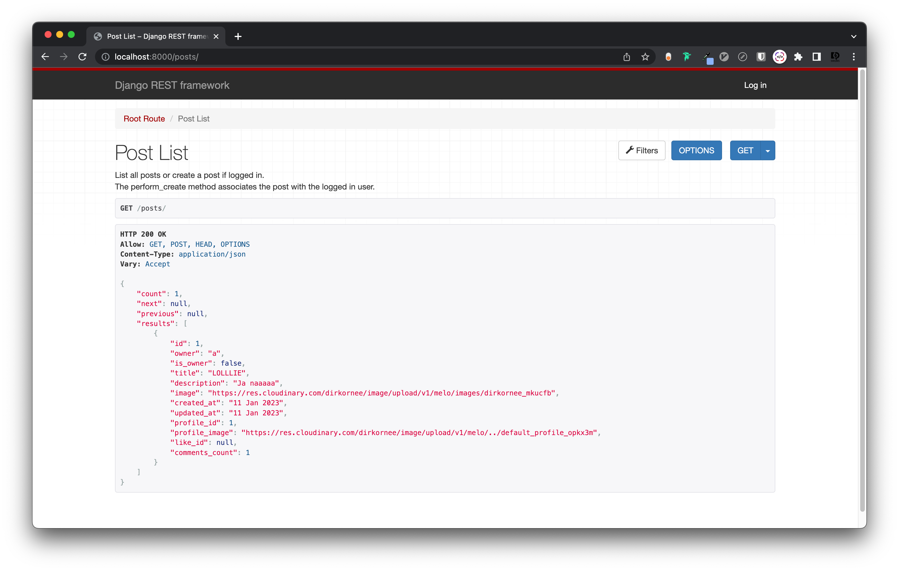
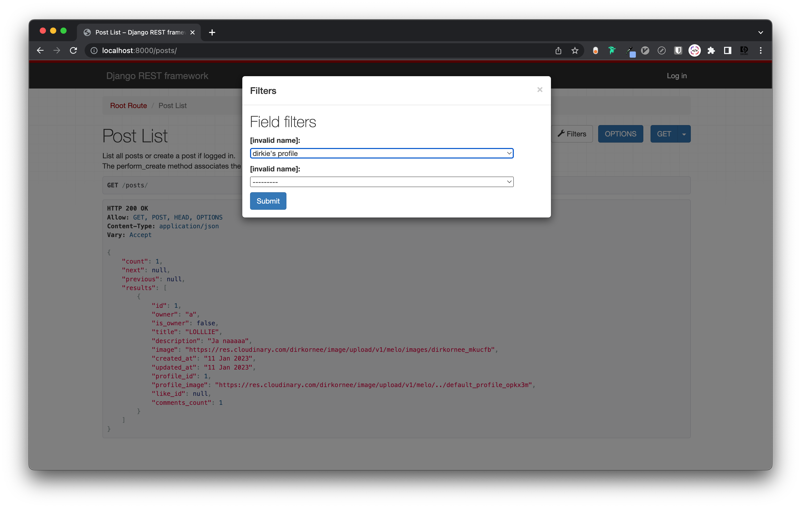
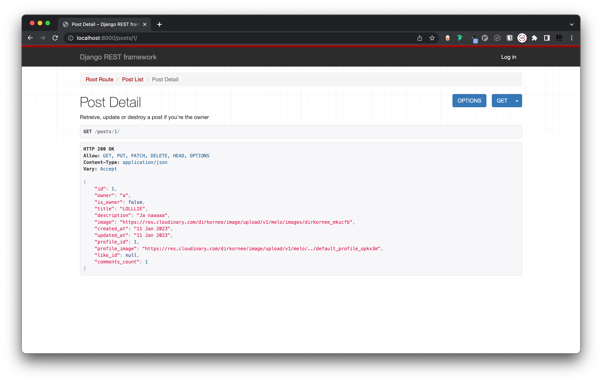
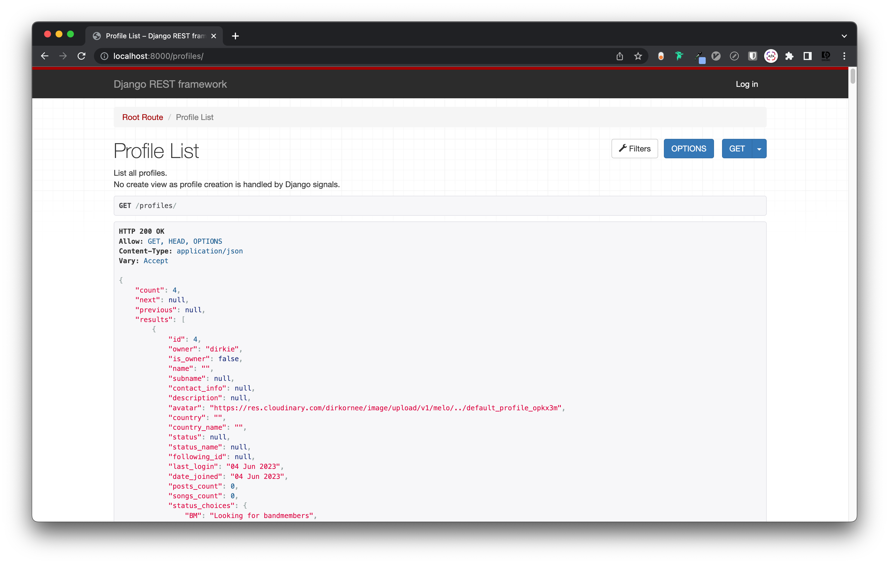
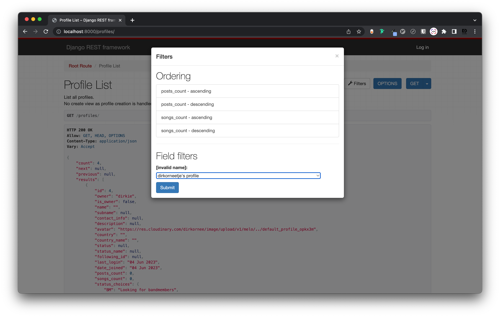

# Melo-Api

## Portfolio Project 5: Advanced Front-End (Back End part)



This project is built as part of the Code Institute Full Stack Software Development course. For this course, Dirk Ornee had to built a fifth Portfolio Project. The focus with this project lies on having a good interactive front-end built in React and a backend built with Django REST that functions as a API to the frontend. This repo contains the backend part of the project.
Since Dirk Ornee is himself a musician, it seemed a good idea to built a social media platform for musicians, where users can find and connect with other musicians and discover and promote new music.

## Live Site

Back-End:
[Melo-api](https://melo-api.herokuapp.com/)
Front-End:
[Melo](https://melo.herokuapp.com/)

## Github Repository

Back-End:
[PortfolioProjectFiveApi](https://github.com/DOdrums/PortfolioProjectFiveAPI)
Front-End:
[portfolioprojectfive](https://github.com/DOdrums/portfolioprojectfive)

## UX

### Business Goals

The main goal of this project is to give a user the ability to find and connect with musicians on Melo. User is able to get a feel for a musicians playing style and ability and can immediately see (from the 'status' indicator) if somebody is available for new projects or not. Furthermore, a User can share his music and possibly gain some popularity with it, by appearing in the 'Most Mic'd Songs' list.

### Target Audience

The target audience for this platform is muscicians. The musicians can be of any experience level, it's a place for both amateurs and professionals to meet fellow musicians!

### User Stories

User stories were written with the front end in mind, but were of course also used to determine things like the database schema, models and views of the DRF backend. The User Stories have the following criteria:

* title
* clear description
* acceptance criteria
* tasks, when acceptance criteria alone weren't clear enough
* story points
* epic
* priority (must have, should have, could have)

In the picture below you can see an example of the user stories before work on the project was started:


And the user stories board after finishing the project:


As you can see, only one user story was left, which didn't fit in the scope of the project in the end. Since it was a 'could have' the decision to leave it out was easily made. To view all the user stories in detail, visit the project page: [user stories board](https://github.com/users/DOdrums/projects/3/views/1)


### Structure of the app

The app is designed to have a solid logic, that makes minimal programming in React necesarry. It can save a lot of time in your front-end, when the models are built in a logical way. For example, auto creating a user profile and instrument when a User instance is created, saves time on having to built forms for this in the front-end.

### Logic/Database Diagram

Part of the logic of the app was thought out by making a database diagram, to visualize which objects will need to be created for this app to be functional and how they will be connected to each other. See the image below:

Initial database diagram:



Django Rest Framework's Class-Based Generic Views were used, to build the models in an Object Oriented and convenient way. For the User model specifically, the Django package 'AllAuth' was used. This does a lot of the work for you, like creating login and sign-up functionality and creating the User model and User Manager model. If you'd compare the database schema with the actual models in this repo, you'll see that some naming and fields changed. When building an app, it's not uncommon to change your opinion of what the best way forward is. So, though the general schematic stayed identical, the specifics changed slightly over time, to accomodate the front-end.

Let's quickly go through the models:

The User model:

* built with Django AllAuth.

The Profile model:

* has foreign key relationship with the user model.
* gets auto-created when a new user instance is created

The Post model:

* these instances represent the User's posts seen in the front-end
* has foreign key relationship with the user model
* has primary key relationship with the comment model and like model

The Song model:

* these instances represent the User's songs seen in the front-end
* has foreign key relationship with the user model
* has primary key relationship with the comment model and mic model

The Mic and Like model:

* are used to add mic's or likes to songs and posts respectively
* has foreign key relationship with the user model

The Instrument model:

* is used to connect and instrument to a profile
* includes instrument and experience level on that instrument as fields
* has foreign key relationship with the user model

The Following model:

* is used to create a follower
* owner fields indicates a owner the follows another user (the followed field)
* has foreign key relationships with User model for both owner and followed field.

The Comment model:

* is used to comment on either songs or posts
* has foreign key relationship with both Post and Song model

### Features

The features of this app will be mostly described in the [Front-End Readme](https://github.com/DOdrums/portfolioprojectfive), but some functionality can be displayed through the DRF dev environment screenshots:

#### Posts and Songs

The posts and songs can be listed and created with ListCreate view. When you run a dev server in DRF, you can view the objects in the database and apply any filters that have been set on the view.



Below you can see what the list view looks like with filtering options. You can filter posts (and songs) by profile:



When you want to get all the details of just one post, you can visit the route to the detail view. This goes for the song models as well.



#### Profiles

Profiles can be listed with the ListView. They cannot be created with this view however, since creation is automatically handled with the creation of User instances. When listing the profiles, you'll see that the choices for countries and status are also displayed. These are used in the front-end to display a select box for the user to select a country when updating their profile.



Just like the posts and songs can be filtered, the profiles can also be filtered. This is to filter out profiles that are followed by a specific User.



By default, the user's personal info is not editable, to limit the chance of user-error. If the user decides they want to chance some of their info, they can hit the edit button, which will cause the 'First name', 'Last name' and 'Phone number' field to pop open.


After hitting 'save', the fields will now all become uneditable again and a little alert will slide in view confirming the edits were saved to the database. After 4 seconds this alert will slide out of the way, but a user can also close the alert themselves if they wish.


On the other side of the dashboard, user will find all their booked appointments. Which they can expand like an 'accordion' by clicking on the element.


When the date of an appointment is less than 48 hours in the future, it's not possible to change or cancel an appointment, which is indicated by greyed out buttons.


When an appointment lays further in the future, user can can cancel the appointment by clicking on the cancel button.
When cancel gets clicked, user will be asked to confirm their choice, by a modal that pops up. This is to make sure the user really meant to click the cancel button, since cancelling an appointment by mistake would be very inconvenient.


The other button present in the appointment accordions is a 'Change date' button. This button will allow the user to change the date of the appointment. After clicking the button, they will be redirected to a page similar to the booking page, except the treatment is pre-selected. Furthermore, the only thing they can change is the date.


#### Home

Let's get on with the rest of the website. The home page features a few elements. We'll look at them from top to bottom.

#### Nav bar 

At the top of the page you'll find a nav bar. This bar has two appearances, for being displayed either on top of the hero-image of the homepage, or above the content of the other pages.


The nav bar will display either a login button, or when user is logged in, their name. When user clicks their name, a menu will pop out with the options to log out or go to their user dashboard.


#### Hero Image

The hero image will probably be the very first element that catches the users eye when visiting this website. It's a stunning image shot at the Nail Salon.


#### Treatments

After user scrolls down a bit, they will see the highlighted treatments. Clicking on the element will bring them to the treatments page, where they can read more about the treatment. Clicking on the book button will bring them to the book page.


#### About

Below the treatments, user will find a little text about the salon, with a photo.


#### Footer

At the bottom of the page, there is a footer. The footer houses a map with the location of NailsbyFaar, some contact info and the social links.


#### About

The next page is the about page. This is simply an extension of the about section on the home page and features an image and some text about the owner of the salon.


#### Treatments

The treatments page features the main treatments with explanations of what they are. There is also a book button for the user to immediately book an appointment.


#### Gallery 

The gallery page displays a little gallery with some images of recent work done by Nailsbyfaar. On the bottom of the page, the user is encouraged to visit her instagram.


#### Contact

The contact page displays a simple form for the user to fill out in order to send a message to the owner.


#### Login/Logout

If a user doesn't have an account yet, they can sign up, by filling in the form.


Once a user has an account, they can login.


If the user wants to logout via the navbar, they'll have to confirm this decision.


#### Admin

Site owner has a lot of control over the website and database entries via the admin panel. If they login as a superuser, they can edit/delete/add a whole range of objects:


The user can look at registered email-adresses, appointments, gallery images, planning, treatments and users. The social accounts are not in use and groups can be used if wanted. Let's have a look at some of them.

The first thing you would probably add is a planning, so users know which times they can book. This is what the planning object looks like:


After adding a planning, some treatments should be added, so a user can actually book a treatment. The treatments can be displayed in the booking module, on the home page and treatment page, both or neither. This is what the overview of different treatments will look like:


A treatment object looks as follows:


After adding these object, a user should now be able to see a fully functional book page and be able to book an appointment. After some appointments are booked, you'll see a list of appointments in the admin panel:


Which when opened, look as follows:


The final thing that can be added is some images for the gallery page.


### Future Features

An important feature for the admin, is a link to a google agenda that displays all appointments in a calender. This way, there is a clear and easy oversight in the planning. This was also the only remaining user story.

#### Notifications

Users can already receive notifications via email, but it would be great to have the option of enabling sms notifications, since these tend to reach the user better (no danger of ending up in the spam folder).


## Credits

### Code

* [Django documentation](https://docs.djangoproject.com/en/4.1/) - for many django specific solutions, like the get_foo_display() 
* [Django rest framework](https://www.django-rest-framework.org/) - for many drf specific solutions 
* [Stackoverflow (answer from chander)](https://stackoverflow.com/a/35325278/16545052) - as inspiration for writing the audio file validator
* Code Institute Walkthrough project - as a broad general inspiration for the whole project.

### Technologies used

[Python](https://www.python.org/) - to write all the logic of the app

[Django](https://www.djangoproject.com/) - used as main framework for the app, which both all backend and most frontend elements are built on. The following notable libraries/packages were added to django:

* django-allauth: for handing all user models and login functionality.
* cloudinary: for saving images in cloudinary and serving them to the client.
* django-countries: for getting a list of all countries as choices in the profile model.
* python-magic: to check audio files for mime type.
* django-filter: to make filtering of model instances in the API possible.

[Django Rest](https://www.django-rest-framework.org/) - used as main framework to turn the app into an API.

[ElephantSQL](https://www.elephantsql.com/) - used to manage a PostgreSQL database.

[Lucidchart](https://www.lucidchart.com/pages/) used to make a database diagram.

[Github](https://github.com/) - used for version control and deployment of the website.

[Heroku](https://dashboard.heroku.com/) - to deploy the app.

## Testing

Extensive testing was done to make sure all the features work as expected. To read all about this, please go to the separate [testing document](TESTING.md).

## Security Features and Defensive Design

### User authentication

* Django's all auth was used for login and sign up functionality.
* Django's superuser is used to limit access to admin panel.

### Form Validation

Extensive form validation is used on front end as well as backend.

### Database Security

All secret keys connecting the database are stored in a env.py file that is never pushed to github. Furthermore, Cross-Site Request Forgery (CSFR) tokens were used on all forms throughout the project.

## Deployment

### Local Deployment

To test the app locally, the terminal within VScode was used. The steps to run this:

* In your project workspace folder, open a terminal
* Run the command: ```python3 manage.py runserver```
* Hit the 'open browser' button or visit ```http://localhost:8000/``` in the browser.
* Use the website as usual.

A local database was used for most of the local deployment usage, since it was necessary for the automated tests to run. However, the switch to using the production database could be easily made, in case migrations needed to be performed or otherwise. Furthermore, in the development version, DEBUG was set to False, so error messages would show follow.

### Production Deployment Initial

Before starting work, the project was deployed to Heroku. This was done early in the process, to prevent having to deal with difficulties of deployment close to the project deadline. The following steps needed to be performed:

#### Create Heroku app:

* Login in to Heroku
* Create a new app.
* Select "New" and "Create new app".
* Give the new app a name and click "Create new app".
* Select a region (Europe for this app).

#### Connect Postgres Database:

* Open your app on the main dashboard of Heroku.
* Open the Resources tab and scroll to the add-ons section.
* Type 'Postgres' and select the Heroku Postgres option.
* Copy the DATABASE_URL in the Config Vars section of the Settings tab.
* To use the Postgres database in your development environment, copy the DATABASE_URL in your env.py file.

#### Deploy App on Heroku:

* Click "Settings".
* Navigate to the "Config Vars" section and click "Reveal Config Vars"
* Add SECRET_KEY variable
* Add CLOUDINARY_URL variable
* Add AWS_ACCESS_KEY_ID and AWS_SECRET_ACCESS_KEY variables.
* Under "Deployment Method" click on "GitHub" to get access to your repository.
* Enable Automatic Deploys" or click "Deploy Branch" to deploy your app.

### Production Deployment Update

Since Heroku stopped offering free tiers on the 28th of november 2022, it was necessary to make a few adjustments to the whole production deployment of the app. 

#### PostgreSQL database:

The Postgres database add-on that was previously used within Heroku was now no longer free and thus a different service had to be used. The choice went to [ElephantSQL](https://www.elephantsql.com/), since they offer a free tier. A [script](https://github.com/Code-Institute-Org/postgres-migration-tool) written by Code Institutes team was used to copy the original database to the new database. The steps are described in the [github readme](https://github.com/Code-Institute-Org/postgres-migration-tool) of that script.

After that, the steps were as follows:

* remove database add on from Heroku.
* remove old DATABASE_URL config var from settings and post new url from ElephantSQL database in its place.
* transform app from free tier to an eco dyno.

## Acknowledgements

This website was built as part of the Full Stack Software Development course from Code Institute. I would like to thank my mentor Adeye Adegbenga, for his excellent feedback and guidance throughout the development of the project. I would also like to thank friends and family, who all took a look at the finished project to make sure it worked well and checked if I could improve things.
