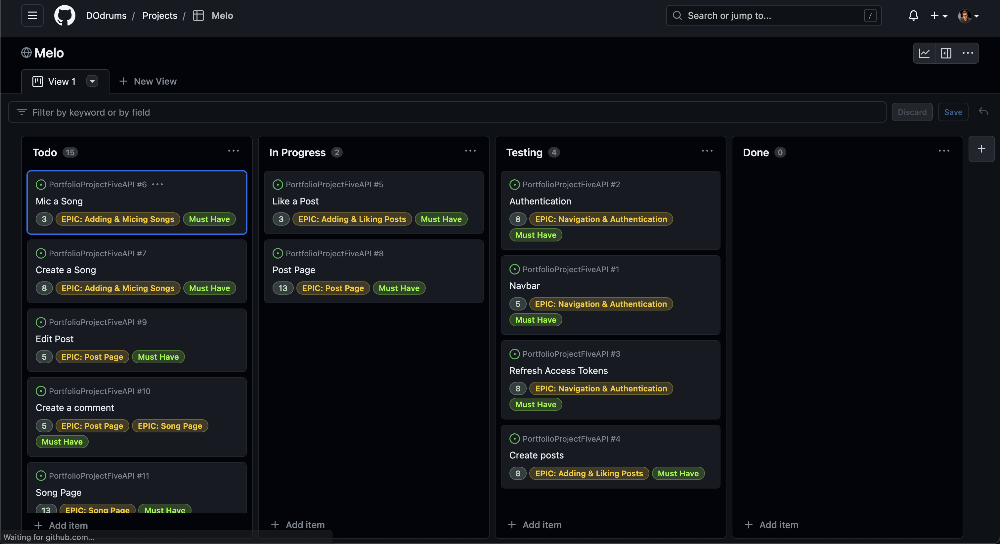
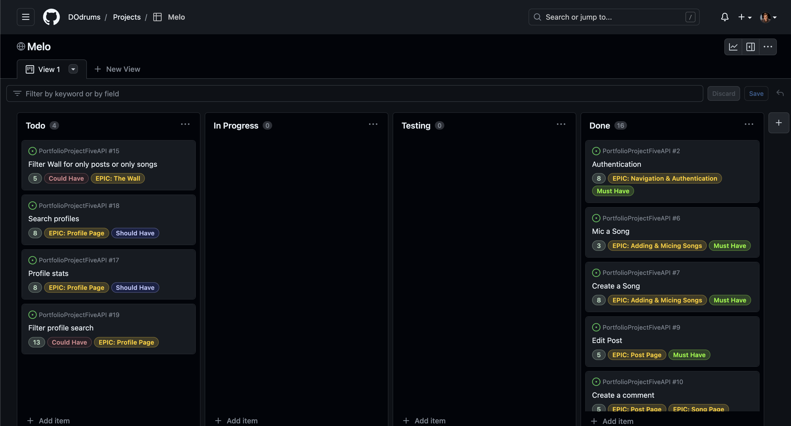

# Melo-Api

## Portfolio Project 5: Advanced Front-End (Back End part)


This project is built as part of the Code Institute Full Stack Software Development course. For this course, Dirk Ornee had to built a fifth Portfolio Project. The focus with this project lies on having a good interactive front-end built in React and a backend built with Django REST that functions as a API to the frontend. This repo contains the backend part of the project.
Since Dirk Ornee is himself a musician, it seemed a good idea to built a social media platform for musicians, where users can find and connect with other musicians and discover and promote new music.

<!-- TOC -->

- [Melo-Api](#melo-api)
    - [Portfolio Project 5: Advanced Front-End Back End part](#portfolio-project-5-advanced-front-end-back-end-part)
    - [Live Site](#live-site)
    - [Github Repository](#github-repository)
    - [UX](#ux)
        - [Business Goals](#business-goals)
        - [Target Audience](#target-audience)
        - [User Stories](#user-stories)
        - [Structure of the app](#structure-of-the-app)
        - [Logic/Database Diagram](#logicdatabase-diagram)
        - [Features](#features)
            - [Posts and Songs](#posts-and-songs)
            - [Profiles](#profiles)
            - [Other models](#other-models)
        - [Future Features](#future-features)
    - [Credits](#credits)
        - [Code](#code)
        - [Technologies used](#technologies-used)
    - [Testing](#testing)
    - [Security Features and Defensive Design](#security-features-and-defensive-design)
        - [User authentication](#user-authentication)
        - [Form Validation](#form-validation)
            - [Post model](#post-model)
            - [Song model](#song-model)
            - [User model](#user-model)
        - [Database Security](#database-security)
    - [Deployment](#deployment)
        - [Local Deployment](#local-deployment)
        - [Production Deployment Initial](#production-deployment-initial)
            - [Create Heroku app:](#create-heroku-app)
            - [Create Postgres Database:](#create-postgres-database)
            - [Connect Postgres Database:](#connect-postgres-database)
            - [Deploy App on Heroku:](#deploy-app-on-heroku)
    - [Acknowledgements](#acknowledgements)

<!-- /TOC -->

## Live Site

Back-End:
[Melo-api](https://melo-api.herokuapp.com/)
Front-End:
[Melo](https://melo.herokuapp.com/)

## Github Repository

Back-End:
[PortfolioProjectFiveApi](https://github.com/DOdrums/PortfolioProjectFiveAPI)
Front-End:
[portfolioprojectfive](https://github.com/DOdrums/portfolioprojectfive)

## UX

### Business Goals

The main goal of this project is to give a user the ability to find and connect with musicians on Melo. User is able to get a feel for a musicians playing style and ability and can immediately see (from the 'status' indicator) if somebody is available for new projects or not. Furthermore, a User can share his music and possibly gain some popularity with it, by appearing in the 'Most Mic'd Songs' list.

### Target Audience

The target audience for this platform is muscicians. The musicians can be of any experience level, it's a place for both amateurs and professionals to meet fellow musicians!

### User Stories

User stories were written with the front end in mind, but were of course also used to determine things like the database schema, models and views of the DRF backend. The User Stories have the following criteria:

* title
* clear description
* acceptance criteria
* tasks, when acceptance criteria alone weren't clear enough
* story points
* epic
* priority (must have, should have, could have)

In the picture below you can see an example of the user stories while working on the project:



And the user stories board after finishing the project:



As you can see, there are 4 user stories left, which didn't fit in the scope of the project in the end. Since these were a 'could have' and 'should have' but not must haves, the decision to leave them out was easily made. To view all the user stories in detail, visit the project page: [user stories board](https://github.com/users/DOdrums/projects/4)


### Structure of the app

The app is designed to have a solid logic, that makes minimal programming in React necesarry. It can save a lot of time in your front-end, when the models are built in a logical way. For example, auto creating a user profile and instrument when a User instance is created, saves time on having to built forms for this in the front-end.

### Logic/Database Diagram

Part of the logic of the app was thought out by making a database diagram, to visualize which objects will need to be created for this app to be functional and how they will be connected to each other. See the image below:

Initial database diagram:


Django Rest Framework's Class-Based Generic Views were used, to build the models in an Object Oriented and convenient way. For the User model specifically, the Django package 'AllAuth' was used. This does a lot of the work for you, like creating login and sign-up functionality and creating the User model and User Manager model. If you'd compare the database schema with the actual models in this repo, you'll see that some naming and fields changed. When building an app, it's not uncommon to change your opinion of what the best way forward is. So, though the general schematic stayed identical, the specifics changed slightly over time, to accomodate the front-end.

Let's quickly go through the models:

The User model:

* built with Django AllAuth.

The Profile model:

* has foreign key relationship with the user model.
* gets auto-created when a new user instance is created

The Post model:

* these instances represent the User's posts seen in the front-end
* has foreign key relationship with the user model
* has primary key relationship with the comment model and like model

The Song model:

* these instances represent the User's songs seen in the front-end
* has foreign key relationship with the user model
* has primary key relationship with the comment model and mic model
* The song model has a custom validator (validators.py) to check if the file is .mp3 or .m4a, which are the only allowed file types.

The Mic and Like model:

* are used to add mic's or likes to songs and posts respectively
* has foreign key relationship with the user model

The Instrument model:

* is used to connect and instrument to a profile
* includes instrument and experience level on that instrument as fields
* has foreign key relationship with the user model

The Following model:

* is used to create a follower
* owner fields indicates a owner the follows another user (the followed field)
* has foreign key relationships with User model for both owner and followed field.

The Comment model:

* is used to comment on either songs or posts
* has foreign key relationship with both Post and Song model

### Features

The features of this app will be mostly described in the [Front-End Readme](https://github.com/DOdrums/portfolioprojectfive), but some functionality can be displayed through the DRF dev environment screenshots:

#### Posts and Songs

The posts and songs can be listed and created with ListCreate view. When you run a dev server in DRF, you can view the objects in the database and apply any filters that have been set on the view.


Below you can see what the list view looks like with filtering options. You can filter posts (and songs) by profile:


When you want to get all the details of just one post, you can visit the route to the detail view. This goes for the song models as well.


#### Profiles

Profiles can be listed with the ListView. They cannot be created with this view however, since creation is automatically handled with the creation of User instances. When listing the profiles, you'll see that the choices for countries and status are also displayed. These are used in the front-end to display a select box for the user to select a country when updating their profile.


Just like the posts and songs can be filtered, the profiles can also be filtered. This is to filter out profiles that are followed by a specific User.


By default, the user's personal info is not editable, to limit the chance of user-error. If the user decides they want to chance some of their info, they can hit the edit button, which will cause the 'First name', 'Last name' and 'Phone number' field to pop open.

#### Other models

All other models have similar list and detail views, but the filters options are most prominent on the previously discussed models.

### Future Features

Future features include an addition to the profile model or possibly a seperate model, to keep track of the highest chart positions of individual users.


## Credits

### Code

* [Django documentation](https://docs.djangoproject.com/en/4.1/) - for many django specific solutions, like the get_foo_display() 
* [Django rest framework](https://www.django-rest-framework.org/) - for many drf specific solutions 
* [Stackoverflow (answer from chander)](https://stackoverflow.com/a/35325278/16545052) - as inspiration for writing the audio file validator
* Code Institute Walkthrough project - as a broad general inspiration for the whole project.

### Technologies used

[Python](https://www.python.org/) - to write all the logic of the app

[Django](https://www.djangoproject.com/) - used as main framework for the app, which both all backend and most frontend elements are built on. The following notable libraries/packages were added to django:

* django-allauth: for handing all user models and login functionality.
* cloudinary: for saving images in cloudinary and serving them to the client.
* python-magic: to check audio files for mime type.
* django-filter: to make filtering of model instances in the API possible.

[Django Rest](https://www.django-rest-framework.org/) - used as main framework to turn the app into an API.

[ElephantSQL](https://www.elephantsql.com/) - used to manage a PostgreSQL database.

[Lucidchart](https://www.lucidchart.com/pages/) used to make a database diagram.

[Github](https://github.com/) - used for version control and deployment of the website.

[Heroku](https://dashboard.heroku.com/) - to deploy the app.

## Testing

Extensive testing was done to make sure all the features work as expected. To read all about this, please go to the separate [testing document](TESTING.md).

## Security Features and Defensive Design

### User authentication

* Django's all auth was used for login and sign up functionality.
* Django's superuser is used to limit access to admin panel.

### Form Validation

Though from validation is used only in the Front-End, the data that's posted to the API does get checked in all sorts of manner. To highlight a few:

#### Post model

The post model has a validator that's installed with the cloudianry package. This validator checks if image files are the right filetype and size.

#### Song model

The song model has a custom validator (validators.py) that checks if the audio file is .mp3 or m4a. Other files are not allowed. It checks both the extension of the file as well as the mimetype.

#### User model

The user model has all sorts of validations for the username and password. Like checking if the passwords match when entered, if it's long enough, dissimilar enough from the username, etc. These validators are handled by AllAuth.


### Database Security

All secret keys connecting the database are stored in a env.py file that is never pushed to github. CSFR and samesite policy's are set in front and back end.

## Deployment

### Local Deployment

To test the app locally, the terminal within VScode was used. The steps to run this:

* In the project workspace folder, open a terminal
* Run the command: ```python3 manage.py runserver```
* Hit the 'open browser' button or visit ```http://localhost:8000/``` in the browser.
* Use the website as usual.

A local database was used for most of the local deployment usage. However, the switch to using the production database could be easily made, in case migrations needed to be performed or otherwise. Furthermore, in the development version, DEBUG was set to False, so error messages would show.

### Production Deployment Initial

Before starting work, the project was deployed to Heroku. This was done early in the process, to prevent having to deal with difficulties of deployment close to the project deadline. The following steps needed to be performed:

#### Create Heroku app:

* Login in to Heroku
* Create a new app.
* Select "New" and "Create new app".
* Give the new app a name and click "Create new app".
* Select a region (Europe for this app).

#### Create Postgres Database:

* Login to ElephantSQL.
* Click on 'Create New Instance'.
* Give the database a name and select the 'Tiny Turtle (free)' plan
* Select region (Stockholm)
* Review if everything is correct
* Create Instance

#### Connect Postgres Database:

* Login to ElephantSQL and select the database that needs to be connected.
* Copy the URL
* Login the Heroku
* Open your app on the main dashboard of Heroku.
* Go to the settings tab
* Reveal config vars
* Add config var 'DATABASE_URL' and paste in the URL as value.
* To use the Postgres database in the development environment, copy the DATABASE_URL in the project env.py file.

#### Deploy App on Heroku:

* Click "Settings".
* Navigate to the "Config Vars" section and click "Reveal Config Vars"
* Add SECRET_KEY variable
* Add CLOUDINARY_URL variable
* Under "Deployment Method" click on "GitHub" to get access to the repository.
* Enable Automatic Deploys" or click "Deploy Branch" to deploy the app.

## Acknowledgements

This website was built as part of the Full Stack Software Development course from Code Institute. I would like to thank my mentor Adeye Adegbenga, for his excellent feedback and guidance throughout the development of the project. I would also like to thank friends and family, who all took a look at the finished project to make sure it worked well and checked if I could improve things.
